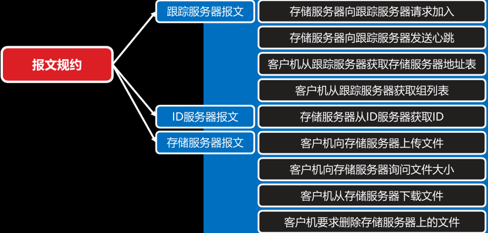
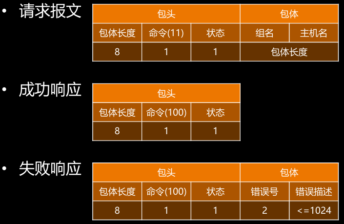
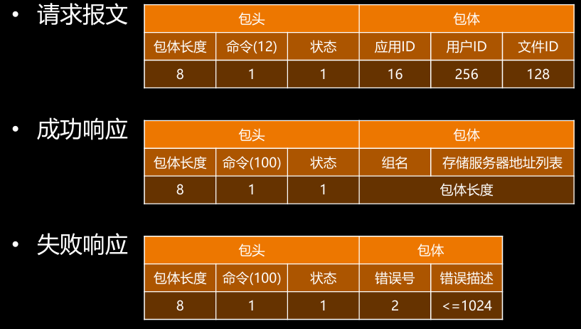
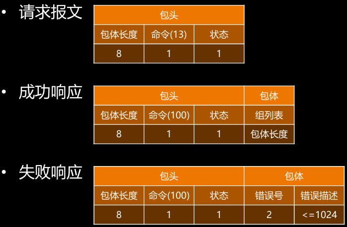
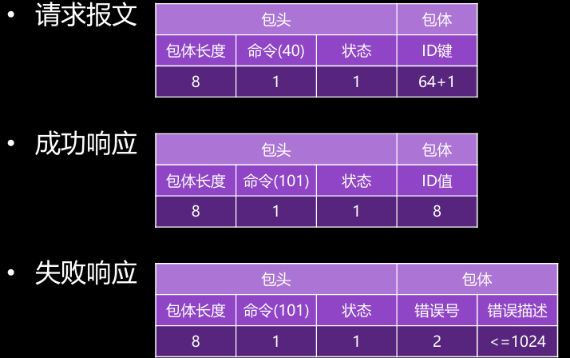
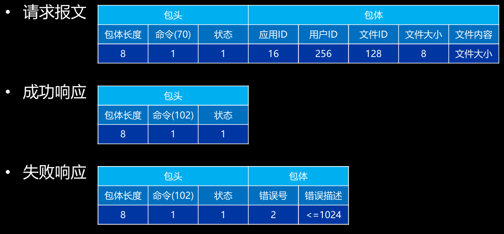
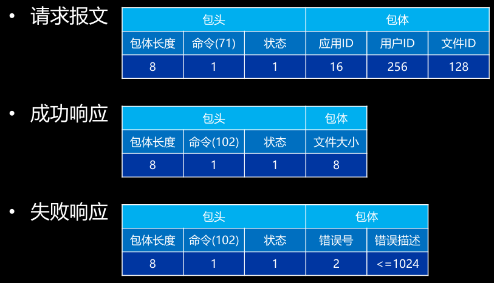
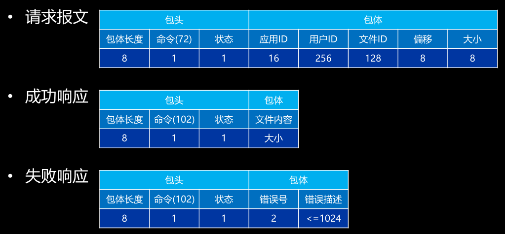
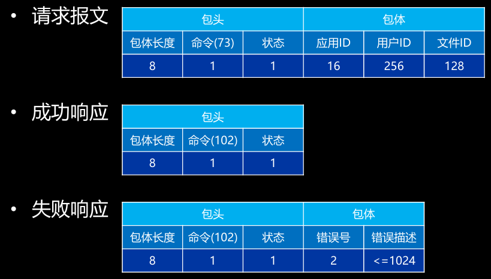

# 分布式流媒体

## 定义

将分布式存储技术应用于流媒体服务业务即分布式流媒体 

- 跟踪服务器：跟踪服务器负责管理所有存储服务器和组。每台存储服务器启动后， 都会与跟踪服务器建立连接，向其通告自己所隶属的组，并保持周期性心跳。跟 踪服务器据此维护组——存储服务器映射表
- 客户机：提供上传、删除等针对存储服务器内容的管理和维护功能
- HTTP服务器：内置的Web Server，支持基于HTTP的流媒体下载和播放
- HTTP客户机：支持HTTP协议的流媒体播放器

- Keepalived：在多台存储服务器和多 台跟踪服务器之间实现热切换

- 组：内容对等的存储服务器集合，其 文件系统通过GlusterFS实时同步– 存储服务器：实际存储流媒体文件的 服务器，同组存储服务器互为备份
- 跟踪服务器集群：由多台跟踪服务器 组成的集群，互为热备，负载均衡

## 服务器

### 单机服务器

缺点 

服务器压力大 存储空间  用户多了后 不堪重负

Centos ubuntu 等等

改进 

存储模块 放置于别的存储集群 类似NAS的东西

### 独立服务器

应用服务器 处理与存储无关的功能

上传客户机  对资源服务器进行管理

交互性越高  时间片越短  I/O速度越快 所需时间片越长

### 分布式存储

分布式 将每个模块独立出去 不单独放置于一台机器

仲裁系统 选着某一存储主机

保证负载均衡

容灾系统 管理多级备份  热切换 主机与备份机实时同步状态 当主机损坏 则交给备份机

可以不用停机维护

跟踪服务器 实时跟踪存储服务器集群的状态

每个组间的服务器互为镜像  可以根据业务需求 将各个组放置到不同的地区

## 系统总体架构

ID服务器 产生ID 保证一个集群中的各个进程ID号等等 唯一

GlusterFs 文件管理系统

### 跟踪服务器

被动接受 存储服务器信息 存储服务器 服务注册

存储服务器 周期发送心跳包  跟踪服务器 周期检查心跳包

### 存储服务器和ID服务器

### 客户端

每个业务可能由一个服务器集群完成 当客户端请求某一业务处理时 需要知道对应服务器的信息

那么集群多了以后 客户机所需要维护的信息就回增多 成本增加 所以 可以类似索引一样的处理 将所有的服务器集群的信息 所能够完成的业务交给某一个专用的服务器来完成

客户机只需要与该服务器进行交互 只需要维护一个服务器的信息即可  由该服务器将所需要处理的业务分发出去

### HTTP服务器和客户机

## 需求分析

### 客户机

#### 上传文件

- 会首先向任意一台跟踪服务器索要可用存储服务器的地址列表
- 跟踪服务器根据客户机提交的用户ID，通过查询数据库确定其所隶属的组，并从 其所维护的数据结构中挑选出若干台该组当前处于活动状态的存储服务器，以地 址列表的形式返回给客户机
- 而后客户机便可从此地址列表中选择一台存储服务器，发起上传文件请求– 后者一方面根据取自ID服务器的唯一标识确定存储路径并保存客户机上传的文件 内容数据，另一方面将客户机提交的文件ID和该文件存储路径的对应关系保存在 数据库中，以备日后下载和删除
- GlusterFS将在稍后的时间里，把此文件同步到组内的其它存储服务器中

#### 下载或删除

- 同样会先向跟踪服务器索要可用存储服务器地址列表，并向其中的一台存储服务 器发起下载或删除请求
- 存储服务器根据客户机提交的文件ID通过查询数据库找到与其对应的文件存储路 径，读取其内容回传客户机或直接将其删除，对于后者还需要同时更新数据库， 以反映存储中所发生的变化
- GlusterFS也同样会把这些变化同步到组内的其它存储服务器中

### HTTP服务器和客户机

- HTTP服务器将客户机的下载功能包装在针对HTTP请求GET方法的处理中， 直接将从存储服务器下载得到的文件内容数据以HTTP响应的形式回传给 HTTP客户机 知 识 讲 解
-  后者可以是简单的wget命令，得到完整的离线媒体文件，也可以是任何支持 HTTP协议的流媒体播放器，以实现在线实时播放

### 存储服务器和ID服务器

- 系统中包括一到多台存储服务器，它们被划分为若干组 
- 每个存储服务器组通过GlusterFS保证其所有组员文件系统的同步性 知 识 讲 解
- 每台存储服务器上的文件保存在特定的目录结构中，其存储路径根据取自ID 服务器的唯一标识计算而得
- 每台存储服务器通过启动时的加入和周期性的心跳，保证其运行状态得以实 时反映于每台跟踪服务器所维护的数据结构中

### 跟踪服务器

-  系统中包括一到多台跟踪服务器，每台跟踪服务器均维护完全相同的数据结 构，以实时跟踪系统中每台存储服务器的状态变化 知 识 讲 解
- 每台存储服务器启动伊始即将自己的详细信息加入到每台跟踪服务器所维护 的数据结构中，并在此后以一定的周期间隔向每台跟踪服务器发出心跳信息， 将自身的状态标记为活动 
- 同时跟踪服务器也以一定的周期间隔检查其所维护的数据结构，将长期收不 到心跳信息的存储服务器标记为离线

## 设计

### 报文规约  

#### 跟踪服务器通信报文

##### 请求加入

定义一个报文 ，TCP是流式结构，根据固定长度的报头 来知晓该包的结构

##### 发送心跳

##### 客户机获取存储服务器地址列表

##### 客户机获取组列表

#### ID服务器通信报文

##### 存储服务器获取ID

#### 存储服务器通信报文

##### 客户机上传文件

##### 客户机询问文件大小

##### 客户机下载文件

##### 客户机要求删除文件

