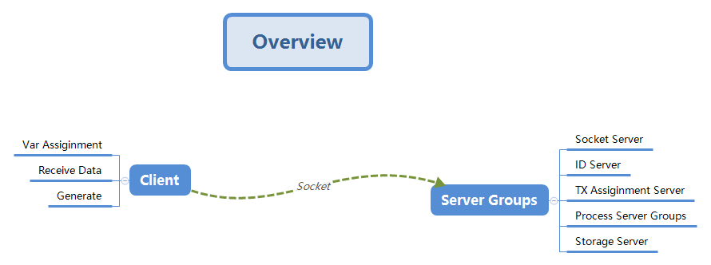
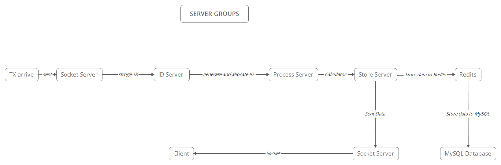

# DistributeServer

## Install

## Features

- 用户在client登陆后，设定变量后通过socket发送数据包给服务器群
  - 首个数据包中变量值包括:
    - 数据包数量
    - 
    - 
  - 之后每个数据包中包括
    - 用户名ID
    - 交易时间
    - 交易量
- Socket Server 接受到数据包后 将数据包暂存到缓冲区中，该缓冲区视作一个队列，以先进先出的规则向ID服务器发送交易数据包
- ID服务器接收到交易数据包后产生hash值后分配给每个交易数据包，然后发送给Assignment Server
- Assignment Server接收到数据后按照分配策略发送给Process Server Groups 
- Process Server 接收到数据包后开始计算 处理完成后 广播给整个Process Server Groups 然后将collation Block 数据包发送给Storage Server 
- Storage Server 接受到数据后先往Redis服务器中存储信息，然后想MySQL数据库中存储
- Storage Server 将数据发挥到Socket Server 
- Socket Server接收到数据后将该数据返回Client
- Client根据数据，产生图表

